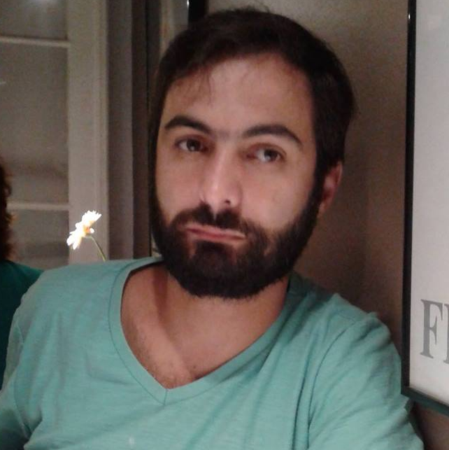

# Garby
_smart recycling_

	
	

### O que é a Garby?
---

A Garby é uma inteligência artificial criada pelos alunos de TECH da ESPM, que visa tentar reconhecer de que material seu lixo é composto, para que assim seu descarte seja feito corretamente!

A Garby está em sua **primeira versão**, sendo testada pela primeira vez aqui, no **ESPM SOUL**!

### Purpose
---

This group has the purpose of developing a automated garbage selection system using AI, applying it throughout ESPM SP during ESPM Soul 2019 to gather 

## Sections

#### Front-end: 
---
  EN - The Front-end team was responsible for developing the website that wouuld take the picture of the garbage placed in front of the camera, communicate with the API to get a prediction on the image taken and treat this response for the user by pointing to the right trashcan and changin the background color.  
  PT - O time de Front-end estava responsável pela construção do website que tiraria as fotos dos itens a serem descartados, se comunicaria com o Back-end para que a predição seja retornada, tratando essa resposta e a exibindo para o usuário através de uma seta que indicará o lixo certo no qual o item deve ser colocado.
###### Responsável 
  - Gabriel Zsigmond

#### Back-end: 
---
 EN - The Back-end team was responsible for building the API to return the predictions of the photos taken by the Front-end, along with the Neural Networks to make such predictions.  
 PT - O time de Back-end estava responsável por montar API que retornaria a predição feita pela inteligência artificial das fotos enviadas pelo Front-end. Outra tarefa dessa equipe era construir a rede neural para que as predições possam ser feitas.

###### Responsáveis
 - Lucas Ciola de Sá
 - Cesar Moura Leite Westphal

#### Infrastructure: 
---
  EN - The infrastructure team was responsible for designing and building the machinery that would take in the response from the API through the Front-end and direct what trash can the placed item should go to.   
  PT - O time de infraestrutura estava responsável pelo design e construção do maquinário que receberia a resposta da API através do Front-end e direcionar o item avaliado na lata de lixo correta.
  
###### Responsável
  - Heitor Leão Nader
  
  
  
#### Data Set: 
---
EN - The Data Set team was responsible for finding images of potential recyclable waste to feed the artificial intelligence, so that it increasingly she learns better to identify different types of recyclable waste.
PT - O time de Data Set foi resposável por encontrar imagens de potenciais lixos recicláveis para alimentar a inteligência artificial,  a fim de que cada vez mais ela aprenda melhor a identificar os diferentes tipos de lixo reciclável.
  
###### Responsáveis
  - Gabriel Zago
  - Zelia Porto

### Week Plans
---

10/04:
  - Front: treat back-end reponse and 1st layout sketch
  - Back: Kaggle model (84%) and websockets  
  - Arduino: machine architecture and budget for materials
  
  ### Contributors
---

Prof. Humberto Sandmann, PhD. (head)
<small>(
[email](mailto:humberto.sandmann@espm.br)
)</small>

Gabriel Zsigmond
<small>(
[github](https://github.com/gzsig) |
[linkedin](https://www.linkedin.com/in/gzsig/) |
[email](mailto:gaazsig@gmail.com)
)</small>

Lucas Ciola de Sá
<small>(
[github](https://github.com/Lucas-CSa) |
[linkedin](https://www.linkedin.com/in/lucas-ciola-de-s%C3%A1-ba0426179/) |
[email](mailto:lucas.cisa19@gmail.com)
)</small>

Zelia Santos Porto
<small>(
[github](https://github.com/zeliasporto) |
[linkedin](https://www.linkedin.com/in/zelia-porto-964656181/) |
[email](mailto:zeliasporto@gmail.com)
)</small>

Cesar Moura Leite Westphal
<small>(
[github](https://github.com/Cesar-mlw) |
[linkedin](https://www.linkedin.com/in/cesar-moura-leite-westphal-222b57138/) |
[email](mailto:cesarmlwestphal@gmail.com)
)</small>

Heitor Leão Nader
<small>(
[github](https://github.com/heitorln) |
[linkedin](https://www.linkedin.com/in/heitor-le%C3%A3o-nader-210897149/) |
[email](mailto:heitor.nader@gmail.com)
)</small>

Gabriel Zago
<small>(
[github](https://github.com/GabrielZagoSapucaia) |
[linkedin](https://www.linkedin.com/in/gabriel-zago-sapucaia-99b654181/) |
[email](mailto:gabrielzsapucaia@hotmail.com)
)</small>
  
### License
---

MIT License

Copyright (c) 2019 ESPM Tech - Soul 2019 Group

Permission is hereby granted, free of charge, to any person obtaining a copy
of this software and associated documentation files (the "Software"), to deal
in the Software without restriction, including without limitation the rights
to use, copy, modify, merge, publish, distribute, sublicense, and/or sell
copies of the Software, and to permit persons to whom the Software is
furnished to do so, subject to the following conditions:

The above copyright notice and this permission notice shall be included in all
copies or substantial portions of the Software.

THE SOFTWARE IS PROVIDED "AS IS", WITHOUT WARRANTY OF ANY KIND, EXPRESS OR
IMPLIED, INCLUDING BUT NOT LIMITED TO THE WARRANTIES OF MERCHANTABILITY,
FITNESS FOR A PARTICULAR PURPOSE AND NONINFRINGEMENT. IN NO EVENT SHALL THE
AUTHORS OR COPYRIGHT HOLDERS BE LIABLE FOR ANY CLAIM, DAMAGES OR OTHER
LIABILITY, WHETHER IN AN ACTION OF CONTRACT, TORT OR OTHERWISE, ARISING FROM,
OUT OF OR IN CONNECTION WITH THE SOFTWARE OR THE USE OR OTHER DEALINGS IN THE
SOFTWARE.

### References
---

### Agradecimentos
---
 - Equipe Técnica ESPM
 - Carlos Rafael Gimenes Neves  | [LinkedIn](https://www.linkedin.com/in/carlosrafaelgn/) | [GitHub](https://github.com/carlosrafaelgn)
 - Flavio Marques de Azevedo  | [LinkedIn](https://www.linkedin.com/in/flaviomarquesazevedo/)
 - Patricia Dranoff  | [LinkedIn](https://www.linkedin.com/in/pdranoff/)
 - Antonio Henrique Selvatici Pinto
